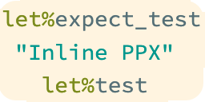

# OCaml Expect and Inline Test Explorer for Visual Studio Code

This extension lets you run OCaml [PPX Expect](https://github.com/janestreet/ppx_expect) and [PPX Inline Test](https://github.com/janestreet/ppx_inline_test) with the (native) Test Explorer UI.

- [Features and drawbacks](#features-and-drawbacks)
  - [Drawbacks](#drawbacks)
- [Getting started](#getting-started)
  - [Dependencies](#dependencies)
  - [Installation](#installation)
  - [Q \& A](#q--a)
    - [Q: What do the groups in the Test Explorer view mean?](#q-what-do-the-groups-in-the-test-explorer-view-mean)
    - [Q: How can I (re-) discover all tests?](#q-how-can-i-re--discover-all-tests)
    - [Q: Where can I see the output of the test run(s)?](#q-where-can-i-see-the-output-of-the-test-runs)
    - [Q: What does the red circle with a point in the middle mean?](#q-what-does-the-red-circle-with-a-point-in-the-middle-mean)
    - [Q: Where can I see the log of the extension?](#q-where-can-i-see-the-log-of-the-extension)
- [Configuration](#configuration)
- [Changes](#changes)
- [Contributing](#contributing)
- [License](#license)

## Features and drawbacks

- uses dune to compile and run the tests
- support for expect PPX tests and inline PPX tests
- filtering of tests by name
- parses the test list output of the test runners to fill the Test Explorer view: the test tree view is consistent with the test runners
- parses OCaml source files on open and save for new, updated or deleted tests
- configurable test discovery on startup: if `Expectppx: Discover On Startup` is set to `false` no tests are run on startup, tests are only run by explicitly running tests or pressing the `Refresh Tests` button.
- support for multiple workspaces
- retries running dune if another instance has locked the project until dune can acquire the lock
- Uses VS Code's native Test Explorer (no additional extension needed)

### Drawbacks

- needs dune
- test discovery can be slow, because all tests of all test runners have to be run.
- when running tests, every test is run on its own, sequentially
- Uses VS Code's native Test Explorer UI

## Getting started

### Dependencies

- Visual Studio Code version 1.65 (February 2022) or higher
- [PPX Expect](https://github.com/janestreet/ppx_expect) or [PPX Inline Test](https://github.com/janestreet/ppx_inline_test)
- [Dune](https://dune.build/): the extension uses Dune to build and run the test runners.

**Attention:** you must be in a trusted workspace. Tests (test runners) can execute arbitrary code, so you do **not** want to run them in untrusted directories!

### Installation

Either

- install the extension directly from the Visual Studio Code Marketplace [Expect and inline  Test Explorer](https://marketplace.visualstudio.com/items?itemName=release-candidate.vscode-ocaml-expect-inline)
- or download the extension from the [latest release at GitHub](https://github.com/Release-Candidate/vscode-ocaml-expect-inline/releases/latest)
- or build the extension yourself by cloning the [GitHub Repository](https://github.com/Release-Candidate/vscode-ocaml-expect-inline) and running `yarn install` and `yarn package` in the root directory of the cloned repo.

### Q & A

#### Q: What do the groups in the Test Explorer view mean?

A: Every workspace folder in the current project has it's own node, `Workspace: WORKSPACE_NAME`. If the project is a single workspace, only one of these exists. A group `Expect and Inline Tests` containing all inline PPX and expect PPX tests. In these subtrees the test cases are grouped by filename.

#### Q: How can I (re-) discover all tests?

A: Push the Refresh Tests button in the upper right of the Test Explorer view.

#### Q: Where can I see the output of the test run(s)?

A: You can either click the `Show Output` button in the upper right corner of the Test Explorer to see the output in a new terminal window,

click on `Go To Test` to the right of a failed test in the test explorer and then `Peek Error` or `Peek Test Output`

or hover over the [Error Lens](https://marketplace.visualstudio.com/items?itemName=usernamehw.errorlens) output in the source file - this preview is too narrow, so the test output is mangled.

#### Q: What does the red circle with a point in the middle mean?

A: That means that dune returned an error (not a failed test). Mostly because of code that does not compile.

#### Q: Where can I see the log of the extension?

A: In the `OUTPUT` tab of the Panel, you have to select the extension named `Expect and Inline Tests` in the upper right drop-down menu.

## Configuration

- `expectppx.discoverOnStartup` - Boolean. Set this to `false` if you do not want to run all expect and inline tests on startup to discover tests. If you want to rediscover all test by running all inline test runners, use the `Refresh Tests` button in the upper right corner of the Test Explorer.

## Changes

See file [CHANGELOG.md](CHANGELOG.md).

## Contributing

See file [CONTRIBUTING.md](CONTRIBUTING.md)

## License

OCaml Expect and Inline Test Explorer for Visual Studio Code is licensed under MIT license. See file [LICENSE](LICENSE)
